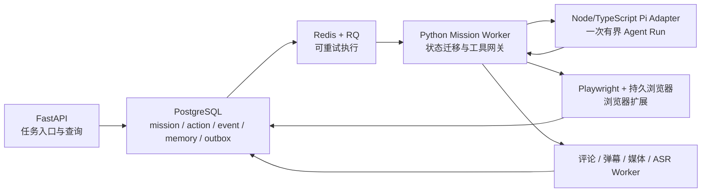

# SourceOS Agent 框架修正：采用 Pi，不采用 LangGraph / LangChain

## 1. 结论

SourceOS 不应引入 LangGraph 或 LangChain。自治浏览器研究智能体应采用以下边界：

```text
SourceOS（任务、事实、调度、恢复、记忆）
  └─ Pi Agent Harness（一次有边界的推理—工具调用循环）
       └─ SourceOS Tools（浏览器、采集、转写、检索、监控）
```

具体采用 **Pi Agent Harness 的 `@earendil-works/pi-agent-core@0.84.1`**，通过独立 TypeScript adapter 接入，精确锁定版本，不让 Pi 类型进入 SourceOS 领域层。Pi 负责模型回合、工具调用、流式事件、上下文处理、中止和运行内消息队列；PostgreSQL、RQ、FastAPI、Playwright 与浏览器扩展继续由 SourceOS 直接拥有。

这一选择符合 Pi 官方定位：仓库把 `pi-agent-core` 定义为具有工具调用和状态管理的 Agent runtime，包 README 将其定义为具有工具执行与事件流的有状态 Agent，而不是工作流、任务调度或业务数据库。[Pi 官方根 README](https://github.com/earendil-works/pi/blob/v0.84.1/README.md) · [`pi-agent-core` README](https://github.com/earendil-works/pi/blob/v0.84.1/packages/agent/README.md)

## 2. 当前官方包身份

核验时点为 2026-08-08（Asia/Shanghai）。

| 项目 | 当前事实 |
|---|---|
| 官方仓库 | [`earendil-works/pi`](https://github.com/earendil-works/pi) |
| Agent 源码 | [`packages/agent`](https://github.com/earendil-works/pi/tree/v0.84.1/packages/agent) |
| npm 包 | `@earendil-works/pi-agent-core` |
| 当前 `latest` | `0.84.1`，发布时间为 2026-08-07 UTC |
| 对应 release / commit | [`v0.84.1`](https://github.com/earendil-works/pi/releases/tag/v0.84.1) / `53fa77ccd8a279eb87e92294ef3687b03ff80112` |
| License | MIT |
| 模块格式 | ESM，`type: module`，自带 `.d.ts` |
| Node.js | `>=22.19.0` |
| 上游构建 TypeScript | `5.9.3` |

版本、引擎、依赖、模块入口、License 和 TypeScript 构建版本均可由固定 release 的 [`package.json`](https://github.com/earendil-works/pi/blob/v0.84.1/packages/agent/package.json)及 [npm `latest` 元数据](https://registry.npmjs.org/%40earendil-works%2Fpi-agent-core/latest)交叉核对；MIT 全文见[官方 LICENSE](https://github.com/earendil-works/pi/blob/v0.84.1/LICENSE)。

### 2.1 包 scope 已经迁移

`@earendil-works/pi-agent-core` 已经取代 `@mariozechner/pi-agent-core`，不是两个并行实现：

- 旧包最新版本停在 `0.73.1`，官方 registry 的 `deprecated` 字段明确要求以后改用 `@earendil-works/pi-agent-core`；
- 新 scope 从后续版本继续发布，当前 `latest` 为 `0.84.1`；
- 新包的 repository 字段指向 `earendil-works/pi/packages/agent`。

来源：[旧包官方 npm registry 元数据](https://registry.npmjs.org/%40mariozechner%2Fpi-agent-core/latest) · [新包官方 npm registry 元数据](https://registry.npmjs.org/%40earendil-works%2Fpi-agent-core/latest)

因此，新代码不得再安装或导入 `@mariozechner/*`。

### 2.2 Node 与 TypeScript 的准确要求

- `Node.js >=22.19.0` 是当前包的硬性运行要求；SourceOS 当前仓库尚未定义 Node 运行时，因此新增 adapter 时必须显式提供满足该条件的独立 Node 环境。
- `TypeScript 5.9.3` 是 Pi `v0.84.1` 自身的开发依赖和发布构建基线，不是 npm peer dependency，也不是 JavaScript 使用者的运行时要求。
- SourceOS 的 adapter 使用 TypeScript 时，首版应继续锁定 `5.9.3`，以减少 `0.x` 包升级与编译器升级同时发生造成的变量。
- 包只提供 ESM `import` export，SourceOS adapter 使用 `NodeNext`/ESM，不建立 CommonJS 兼容层。

来源：[`pi-agent-core/package.json`](https://github.com/earendil-works/pi/blob/v0.84.1/packages/agent/package.json) · [Pi `tsconfig.base.json`](https://github.com/earendil-works/pi/blob/v0.84.1/tsconfig.base.json)

## 3. Pi 当前可以承担什么

### 3.1 Agent loop

`Agent.prompt()` 启动一次循环：模型生成 assistant message；如果包含 tool call，则执行工具、追加 tool result，再发起下一回合，直到模型停止、回合停止钩子触发或队列耗尽。`continue()` 可以从以 user/toolResult 结尾的已有上下文继续；需要更底层控制时可直接使用 `agentLoop` / `agentLoopContinue`。[包 README 的事件与低层 API](https://github.com/earendil-works/pi/blob/v0.84.1/packages/agent/README.md) · [Agent loop 源码](https://github.com/earendil-works/pi/blob/v0.84.1/packages/agent/src/agent-loop.ts)

SourceOS 应把它用作一次“定义局部问题 → 调工具 → 评估结果 → 给出下一动作”的认知循环，不把整个数小时或数天的采集任务塞进一个 Pi 调用。

### 3.2 运行状态与上下文

`AgentState` 保存 system prompt、model、thinking level、tools、messages，以及只读的 streaming message、pending tool calls 和 error message。`transformContext` 可在每次模型调用前裁剪或注入上下文，`convertToLlm` 可将应用自定义消息过滤/转换成模型消息；`prepareNextTurn` 可改变下一回合的上下文、模型或思考级别。[状态与配置类型](https://github.com/earendil-works/pi/blob/v0.84.1/packages/agent/src/types.ts) · [`Agent` 实现](https://github.com/earendil-works/pi/blob/v0.84.1/packages/agent/src/agent.ts)

这些是 **Agent 进程内运行状态**。SourceOS 可以从 PostgreSQL 中保存的 transcript、任务摘要和证据引用重建它，但不能把它当成任务事实源。

### 3.3 工具

`AgentTool` 使用 TypeBox schema 描述参数，工具可以流式报告进度；工具批次默认并行，也可全局或按工具强制顺序执行。`beforeToolCall` 在参数验证后执行，可阻止调用；`afterToolCall` 可变换内容、details、错误状态、usage 和终止提示；全部工具结果都标记 `terminate` 时，可跳过后续模型回合。[工具定义与钩子类型](https://github.com/earendil-works/pi/blob/v0.84.1/packages/agent/src/types.ts) · [工具执行说明](https://github.com/earendil-works/pi/blob/v0.84.1/packages/agent/README.md#tools)

对 SourceOS 而言，Pi 工具只应是稳定的业务端口，例如：

```text
discover_targets
inspect_page
browser_action
collect_all_comments
collect_all_danmaku
enqueue_media_transcription
check_job
query_memory
write_finding
create_or_update_monitor
```

工具实现和数据完整性判断属于 SourceOS；Pi 只决定何时调用以及如何根据返回结果重规划。

### 3.4 事件

Pi 提供 `agent_start/end`、`turn_start/end`、`message_start/update/end`、`tool_execution_start/update/end`。`Agent.subscribe()` 的监听器按注册顺序等待，`prompt()`/`waitForIdle()` 会在 `agent_end` 监听器完成后才结束，因此适合把事件稳定转换为 SourceOS 的 NDJSON adapter 事件。[事件顺序与 settle 语义](https://github.com/earendil-works/pi/blob/v0.84.1/packages/agent/README.md#event-flow) · [事件联合类型](https://github.com/earendil-works/pi/blob/v0.84.1/packages/agent/src/types.ts)

SourceOS 应保存有恢复价值的事件边界：完整 message、工具开始/结束、回合结束和最终停止原因；文本 token delta 只作为实时 UI 流，不作为业务状态迁移依据。

### 3.5 Abort 与运行控制

`Agent.abort()` 触发当前 run 的 `AbortController`，signal 被传给模型流、上下文变换、工具和事件监听器；`waitForIdle()` 等待当前 run 完全收敛；`reset()` 只能在 idle 时清空运行状态。[`Agent` 控制实现](https://github.com/earendil-works/pi/blob/v0.84.1/packages/agent/src/agent.ts)

Pi abort 只表示“停止当前认知回合”。任务是暂停、取消还是等待恢复，必须由 PostgreSQL 中的 mission 状态决定。

### 3.6 Steering / follow-up 队列

`steer()` 和 `followUp()` 分别提供当前 run 完成一轮工具执行后的转向消息，以及 Agent 本来要停止时的后续消息；两类队列支持 `one-at-a-time` 和 `all` 两种 drain 模式，也可清空。它们是 `Agent` 实例中的内存数组，不是持久任务队列；steering 也不会中途撤销已经开始的当前工具批次。[队列行为说明](https://github.com/earendil-works/pi/blob/v0.84.1/packages/agent/README.md#steering-and-follow-up) · [队列源码](https://github.com/earendil-works/pi/blob/v0.84.1/packages/agent/src/agent.ts)

因此，RQ 负责跨进程任务队列，PostgreSQL 负责任务事实；Pi 队列只用于一个活跃 run 内的临时控制。

### 3.7 模型与传输抽象

Pi 通过注入的 `StreamFn` 与模型运行时解耦，通常连接同版本 `@earendil-works/pi-ai`。`streamProxy()` 还可将模型、上下文和选项通过 Bearer token 发送到后端 `/api/stream`，并从 SSE 数据流重建消息。`pi-ai` 的 provider transport 类型为 `sse | websocket | websocket-cached | auto`，是否真正支持某种 transport 取决于具体 provider。[`StreamFn` 契约](https://github.com/earendil-works/pi/blob/v0.84.1/packages/agent/src/types.ts) · [`streamProxy` 源码](https://github.com/earendil-works/pi/blob/v0.84.1/packages/agent/src/proxy.ts) · [`pi-ai` Transport 类型](https://github.com/earendil-works/pi/blob/v0.84.1/packages/ai/src/types.ts)

SourceOS 首版不需要 Pi remote-session client/protocol。Python 与 Node adapter 之间使用自有版本化 NDJSON stdio 协议最轻，模型调用由 Node/Pi 直接完成或通过 SourceOS Model Gateway 完成。

## 4. Pi 当前不应被视为什么

### 4.1 不是 SourceOS 的耐久工作流引擎

`pi-agent-core@0.84.1` 已导出 Session/SessionStorage、内存/JSONL repository 等新接口，并另有 SQLite session backend；这些对象记录会话 entry、lane、operation 和 usage，但它们仍不是 SourceOS 的 mission、采集游标、RQ job、监控水位、证据完整性账本或业务状态机。[Session 类型](https://github.com/earendil-works/pi/blob/v0.84.1/packages/agent/src/harness/session/types.ts) · [SQLite session backend](https://github.com/earendil-works/pi/blob/v0.84.1/packages/session-backends/sqlite-node/README.md)

更关键的是，`v0.84.1` 中导出的 `AgentHarness` 仍将 `prompt`、`resume`、`abort`、`steer`、`followUp`、`runToCompletion`、watch 和 lane 等主要方法实现为 `HarnessNotImplemented`，已有 record 的 restore 也会直接拒绝。因此，当前发布的 harness/session 层不能承担 SourceOS 的生产级耐久任务恢复。[`AgentHarness` 固定版本源码](https://github.com/earendil-works/pi/blob/v0.84.1/packages/agent/src/harness/agent-harness.ts)

结论：首版只依赖成熟的 `Agent` / agent loop API；不依赖 Pi 新 session/harness API 完成任务恢复，并把它列入后续版本观察项。

### 4.2 不提供业务数据库

Pi core 没有 SourceOS 所需的 PostgreSQL schema、迁移、事务边界、目标目录、证据谱系、评论/弹幕快照、媒体转写索引和监控水位。Pi 的 SQLite 包是 Agent session backend，不是 SourceOS 业务数据库。[core 包依赖与导出](https://github.com/earendil-works/pi/blob/v0.84.1/packages/agent/package.json) · [SQLite backend 定位](https://github.com/earendil-works/pi/blob/v0.84.1/packages/session-backends/sqlite-node/README.md)

### 4.3 不提供 scheduler 或分布式任务队列

Pi 没有 cron、监控唤醒、分布式 lease、worker 并发、任务超时重领、死信、RQ job 生命周期或跨进程 exactly-once effect。steer/follow-up 只是单个 Agent 实例的运行内消息队列。[Agent 队列源码](https://github.com/earendil-works/pi/blob/v0.84.1/packages/agent/src/agent.ts)

### 4.4 不提供业务长期记忆

Pi messages、上下文压缩和 session entry 面向模型会话；它不定义 SourceOS 的主体、目标、来源、证据、发现、反证、完整性、站点能力、账号、监控和跨任务知识关系。这些长期记忆必须由 SourceOS 的 PostgreSQL 与内容文件仓定义，Pi 通过 `query_memory` 等工具按需读取。

### 4.5 不提供浏览器采集与完整性证明

`pi-agent-core` 没有 Playwright、浏览器扩展、评论分页、弹幕分段、媒体获取或 ASR；其通用工具接口可以调用这些能力，但全量完成条件和失败恢复必须由 SourceOS 工具实现。[Agent package 的官方职责](https://github.com/earendil-works/pi/blob/v0.84.1/packages/agent/README.md)

## 5. SourceOS 的最小集成边界



### 5.1 TypeScript Pi adapter

建立一个很小的 `agent-runtime` package，只依赖：

```text
@earendil-works/pi-agent-core@0.84.1
@earendil-works/pi-ai@0.84.1
typescript@5.9.3
```

Python Worker 每次执行一个有界认知步骤时启动 Node 子进程，通过 stdin/stdout 交换版本化 NDJSON：

```text
Python -> run.start       mission_id, action_id, prompt, messages, tool schemas, budget
Node   -> agent.event     message/tool/turn/final events
Node   -> tool.request    call_id, tool_name, validated_args
Python -> tool.response   call_id, result/error/job_id
Python -> run.abort       reason
Node   -> run.finished    stop_reason, final_message, usage
```

协议只使用 SourceOS DTO；数据库实体不得导入 Pi 类型。Pi 升级只影响 adapter 和协议合同测试。

### 5.2 工具网关

- 短操作：Python 直接调用已有 repository、检索或 Browser Coordinator，并把结果返回 Pi。
- 长操作：工具只创建带唯一 effect key 的 RQ job，立即返回 `job_id`；mission 进入 `waiting_job`。评论全量采集、弹幕、媒体获取和完整转写完成后，由调度器唤醒新的有界 Pi run。
- 浏览器：Pi 不直接拥有 Playwright Browser 对象。`browser_action` 通过 `browser_session_id` 调用 Python/扩展桥，持久浏览器状态由 Browser Runtime 管理。
- 所有工具结果只携带 ID、摘要和必要片段；全量评论、媒体与逐字稿留在 PostgreSQL/文件仓。

这种方式利用 Pi 的 async tool、流式事件和 abort signal，同时避免让 Node 子进程持续占用数小时等待重任务。[AgentTool 与 AbortSignal 契约](https://github.com/earendil-works/pi/blob/v0.84.1/packages/agent/src/types.ts)

### 5.3 FastAPI、RQ 与浏览器的职责

| 组件 | 唯一职责 |
|---|---|
| FastAPI | 创建/查询 mission，接收暂停、继续和取消命令，流式展示进度；不在请求进程里运行 Pi |
| PostgreSQL | mission 真相、状态版本、动作、结果、监控水位、Agent transcript、幂等键与 outbox |
| Redis/RQ | 执行已经由 PostgreSQL 定义的 action；不是任务事实源 |
| Pi adapter | 一次 Agent loop；根据可用工具决定下一动作；输出事件和结构化结果 |
| Playwright/扩展 | 页面观察、交互、网络/媒体捕获和会话保持 |
| 采集/媒体 Worker | 全量分页、对账、下载、转码、ASR、断点与完整性证明 |

## 6. 不依赖 LangGraph 的耐久 mission 状态

SourceOS 已有数据库和队列，不需要再引入一套图运行时。耐久状态用普通关系表和显式状态转换实现。

### 6.1 最小数据模型

```text
mission
  id, objective, status, plan_json, current_action_id,
  state_version, wake_at, created_at, updated_at

mission_action
  id, mission_id, kind, status, input_ref, output_ref,
  effect_key UNIQUE, attempt, rq_job_id, lease_expires_at, error

mission_event
  mission_id, seq, event_type, payload, created_at

agent_run
  id, mission_id, action_id, pi_version, model,
  prompt_version, status, stop_reason, usage, started_at, finished_at

agent_message / agent_tool_call
  agent_run_id, seq, payload, status, result_ref

monitor
  mission_id, target_id, schedule, next_run_at, watermark, status

outbox
  id, topic, payload, idempotency_key UNIQUE, dispatched_at
```

### 6.2 状态推进规则

1. FastAPI 在 PostgreSQL 事务中创建/修改 mission，并同时写入 outbox。
2. dispatcher 将 outbox 投递到 RQ；重复投递由 `effect_key`/`idempotency_key` 吸收。
3. RQ Worker 领取 action，使用 `state_version` 乐观锁和 lease 把它推进为 `running`。
4. Worker 从 PostgreSQL 读取当前任务、已完成动作、记忆和证据引用，构造一次 Pi run。
5. Pi 的工具副作用必须通过 SourceOS Tool Gateway，以 `mission_id + action_id + call_id` 形成稳定 effect key。
6. 一个有界 run 完成后，在同一事务中保存结果、推进 mission、创建后续 action 并写 outbox。
7. 进程崩溃后，过期 lease 被回收；Worker 从 PostgreSQL 的最后提交状态重新构造 Pi，不从 Pi 内存恢复。
8. 监控 scheduler 只负责把 `next_run_at <= now()` 的 monitor 转成新 action；水位和监控状态仍在 PostgreSQL。

### 6.3 状态机不需要图框架

首版只需要少量显式状态：

```text
defining -> planning -> executing -> waiting_job
         -> assessing -> recovering -> synthesizing
         -> monitoring -> completed | blocked | cancelled
```

允许的转换由 Python 领域函数集中定义；计划本身存为可版本化 JSON，Agent 每轮可重写后续 action。确定性流程使用普通代码，只有“下一步做什么、是否扩展来源、如何恢复”交给 Pi。这样既保留 Agent 自主性，又让崩溃恢复、幂等和全量验收保持可测试。

## 7. 版本与验证决策

### 7.1 直接修正项

- 删除设计中的全部 LangGraph、LangChain、checkpoint、subgraph 和 graph state 依赖。
- 将 Agent runtime 改为 `@earendil-works/pi-agent-core@0.84.1`。
- 将原先归给 LangGraph checkpoint 的状态全部收回 SourceOS PostgreSQL。
- 将 Agent 编排表达改为“PostgreSQL mission/action 状态机 + RQ action execution + 有界 Pi run”。
- 暂不采用尚未实现完整恢复的 Pi `AgentHarness`；使用 `Agent`，并由 SourceOS 重建上下文。

### 7.2 升级门槛

Pi 仍为 `0.x` 且发布频繁，必须精确锁定 direct dependency 和 lockfile。每次升级至少验证：

- NDJSON 协议和全部 AgentEvent 映射；
- tool schema、并行/顺序执行、before/after hook；
- abort、超时与子进程强制终止；
- steer/follow-up 队列语义；
- 模型错误是否以 `error/aborted` stop reason 正确结束；
- 重放同一 RQ job 不产生重复工具副作用；
- Pi 进程在任意回合被杀后，mission 能从 PostgreSQL 继续；
- 全量评论、弹幕和转写的完成状态不依赖 Pi transcript。

## 8. 最终选型语句

> SourceOS 采用 Pi Agent Harness 的 `@earendil-works/pi-agent-core@0.84.1` 作为轻量、可替换的认知执行内核，不采用 LangGraph 或 LangChain。Pi 只拥有一次有界运行中的模型消息、工具循环、事件、队列与中止；SourceOS 继续拥有 PostgreSQL mission 状态、RQ 任务、浏览器、采集完整性、身份、证据和长期记忆。耐久执行通过显式 mission/action 状态机、事务 outbox、幂等 effect key、lease 和可重建 Pi run 实现。

## 9. 一手来源索引

- [Pi 官方仓库](https://github.com/earendil-works/pi)
- [Pi `v0.84.1` release](https://github.com/earendil-works/pi/releases/tag/v0.84.1)
- [`pi-agent-core` package README](https://github.com/earendil-works/pi/blob/v0.84.1/packages/agent/README.md)
- [`pi-agent-core` package.json](https://github.com/earendil-works/pi/blob/v0.84.1/packages/agent/package.json)
- [`Agent` 源码](https://github.com/earendil-works/pi/blob/v0.84.1/packages/agent/src/agent.ts)
- [agent loop 源码](https://github.com/earendil-works/pi/blob/v0.84.1/packages/agent/src/agent-loop.ts)
- [Agent 类型与工具/事件契约](https://github.com/earendil-works/pi/blob/v0.84.1/packages/agent/src/types.ts)
- [proxy transport 源码](https://github.com/earendil-works/pi/blob/v0.84.1/packages/agent/src/proxy.ts)
- [Session 类型](https://github.com/earendil-works/pi/blob/v0.84.1/packages/agent/src/harness/session/types.ts)
- [`AgentHarness` 当前实现](https://github.com/earendil-works/pi/blob/v0.84.1/packages/agent/src/harness/agent-harness.ts)
- [SQLite session backend](https://github.com/earendil-works/pi/blob/v0.84.1/packages/session-backends/sqlite-node/README.md)
- [当前 npm registry 元数据](https://registry.npmjs.org/%40earendil-works%2Fpi-agent-core/latest)
- [旧 scope npm registry 元数据](https://registry.npmjs.org/%40mariozechner%2Fpi-agent-core/latest)
